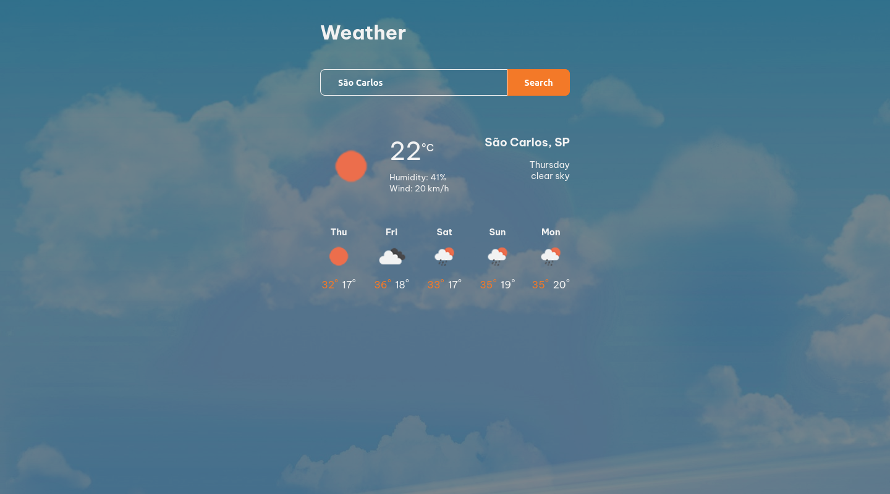

<h1> React Weather App </h2>

 Aplicação em ReactJS de previsão do tempo utilizando as APIS openweathermap e opencagedata. È possível pesquisar por locais e ver o clima e previsão do tempo deste local 

<a href="https://react-weather-app-augusto-ravazoli.vercel.app/">
https://react-weather-app-augusto-ravazoli.vercel.app/
</a>

<h2> Screenshot </h2>

